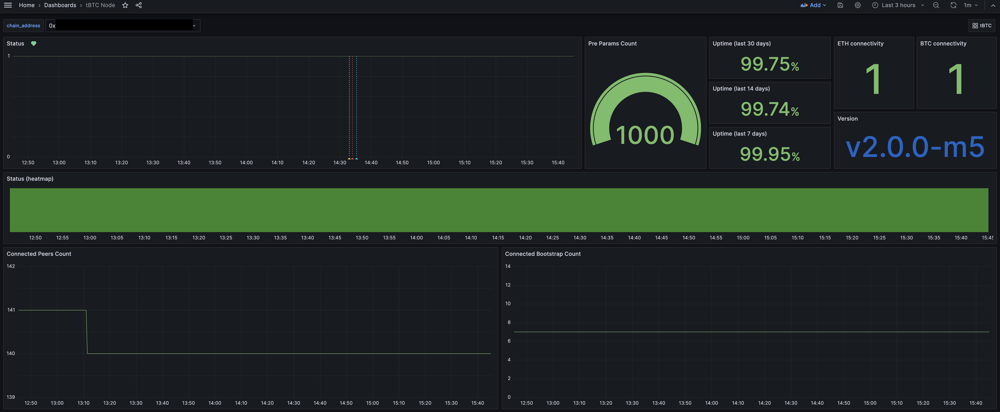
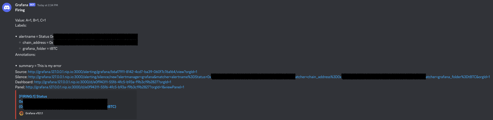
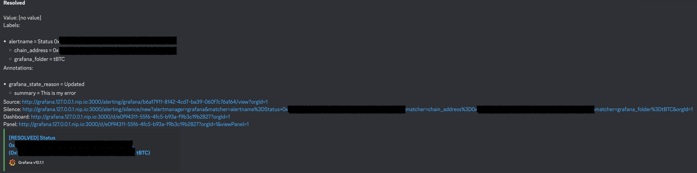
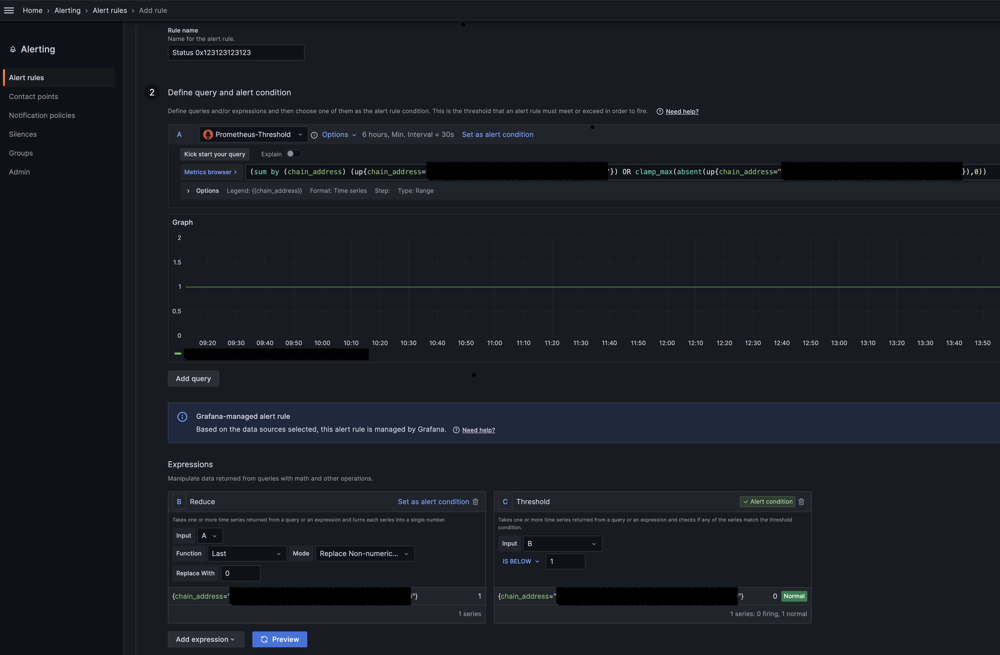
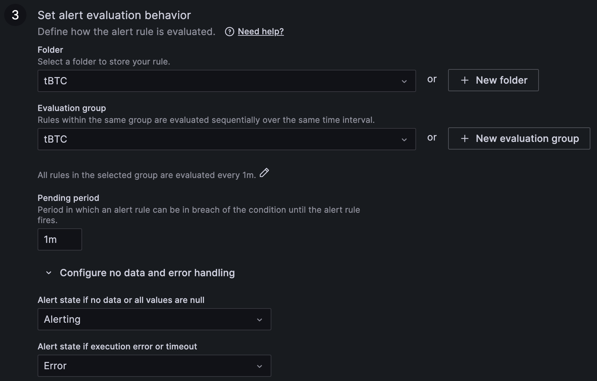

ifdef::env-github[]
:tip-caption: :bulb:
:note-caption: :information_source:
:important-caption: :heavy_exclamation_mark:
:caution-caption: :fire:
:warning-caption: :warning:
endif::[]

// enable icons in the VSCode extension
:icons: font

= tBTC Node monitoring

This repository contains a template for simple monitoring stack.

Features:

* Display tBTC node metrics
* Alerting (via Discord)

The template consists of:

* Docker Compose manifest with Grafana and Traefik (reverse proxy and SSL)
* Configuration for Grafana
  * Pre-configured data source with Threshold's Prometheus (https://monitoring.threshold.network/prometheus/)
  * Policy and Contact point with Discord
  * Dashboard

== Screenshots

=== Grafana dashboard

=== Alerts on Discord

== How to start?

The monitoring can be run on your local machine or on a server.
The only requirement is to have Docker and Docker Compose installed.
If you want to use SSL/TLS certificates from Let's Encrypt, you need to have
a domain name and/or a fixed IP address.

=== Initial setup

1. Fork this repository.
2. Copy `.env.template` into `.env` file. Fill in the variables. That file is
used by Docker Compose.
3. (optional) Modify `docker-compose.yaml` file. Uncomment HTTPS parts if you have
a domain name and/or a fixed IP address.
4. Modify `config/grafana/provisioning/alerting/contactpoints.yaml` file. Replace
`<your_discord_webhook_url>` with your Discord webhook URL.
5. Run `docker-compose up -d` to start the stack.
6. Open Grafana in your browser (http://grafana.127.0.0.1.nip.io by default).
7. Login with `admin`/`admin` credentials. Change the password.

=== Dashboard configuration

1. Open `Dashboards` and select New -> Import.
2. Paste the content of `dashboard.json` file into the `Import via panel json` field.
3. Click `Load` and then `Import` (select proper pre-defined data source).
4. Go to `Dashboards` and select `tBTC Node` dashboard.
5. Go to dashboard settings and replace variable `chain_address` with your node's address.
+
Currently, the dashboard contains 2 addresses - these are tBTC bootstrap nodes.
They don't expose all metrics, thus the dashboard won't work fully with them.

TIP: It's recommended to create a separate dashboard for each node.

=== Alerting configuration

1. Open `Dashboards` and click Edit on `Status` panel.
2. Go to `Alert` tab and click `Create alert rule from this panel`.
3. Set the name. Recommended schema: `Status <chain_address>`.
4. In the 3rd point create a folder and an evaluation group.
Recommended name: `tBTC` for both. Use `1m` for evaluation interval. Set `1m` for
`Pending period`. Take a look at the screenshots below.
5. Complete the 4th point as you wish. These information will be placed in the alert.
6. The 5th point is not needed.
7. Click `Save rule and exit`.

